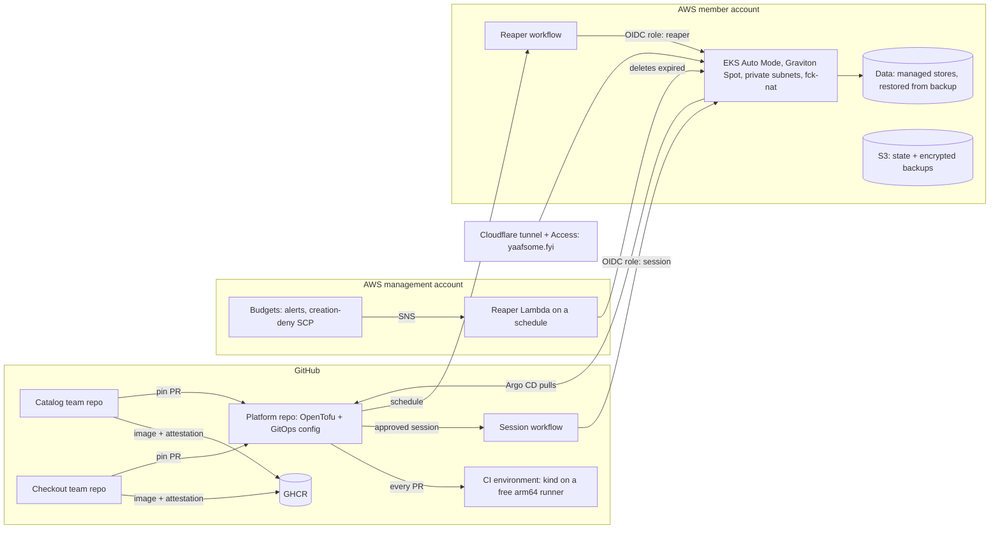

# Plan

The one living document for this project: what it is for, how it is built and run, the stages of work, the questions still
open, and the decisions made. **Rewritten from scratch on 2026-10-08** after the owner made everything replaceable and
lifted the zero-spend rule; the evidence behind it is [`docs/research/2026-10-08-rebuild-research.md`](docs/research/2026-10-08-rebuild-research.md).
The plan it replaces, built around the Floci emulator, is at the tag `archive/floci-era` (made when this lands).

**How it is used.** Each stage starts with questions in chat; the answers become decision rows (one line of *what*, one of
*why*), the stage's checklist is ticked as pull requests land, and each merged PR adds one line to the log. Code comments
cite decisions as `PLAN.md D<n>`. Numbers are never reused: rows carried over from the old plan keep theirs, new ones start
at D47. **Status of this version: a proposal.** The rows marked *proposed* and the questions marked **?** are for the
owner to settle before stage 1 starts.

## What this is

A fictional online store, run the way a small company would run it, built by one person to learn and to show the work. The
owner plays the **DevOps engineer and cloud architect** who sets up delivery and hosting; AI agents play everyone else.

| Who | Played by | Pressure on the platform |
|---|---|---|
| **Two development teams** (Catalog, Checkout), each owning its services | AI agents, each team with its own GitHub identity | A steady stream of pull requests, much of it AI-written, that must be safe before it ships |
| **Customers** | Load generators whose journeys AI agents write and vary | Everyday traffic, spikes, abuse |
| **Bad days** | Chaos experiments and planted faults | A failing dependency, a lost cluster, a bad release, a leaked credential |

**Who it is for.** First the owner: learning the tooling and growing as a solutions architect. Then reviewers (recruiters,
hiring managers), who spend a few minutes, will not run anything, and judge the decisions, the diagrams, the cost
awareness and the CI ([research §4](docs/research/2026-10-08-rebuild-research.md#4-proven-practice-for-the-platform)).

**What a reviewer should conclude in ten minutes:** *this person could be the first platform hire at a startup.* They
deliver safely (every gate proved against a planted fault), run real AWS responsibly (it costs almost nothing and cannot
run away), know what production needs (a costed, reviewed design), and can say exactly what was proved and how.

### Goals and how each is measured

| Goal | Measured by |
|---|---|
| **G1 Safe delivery** for agent-written change | Each gate proved against a planted fault; DORA metrics from GitHub data |
| **G2 Real AWS, responsibly** | Every claim labelled *designed*, *verified in CI* or *verified on AWS (date)*; sessions logged with their cost |
| **G3 Cost discipline** | No compute when idle, only pennies of storage; a monthly ceiling that the guardrails enforce, proved by a planted runaway |
| **G4 Reliability you can measure** | SLOs with burn-rate alerts; every AWS session is a recovery drill with a measured RTO and RPO |
| **G5 Architecture judgement** | A Well-Architected review, a cost model with tiers, a threat model and a PCI DSS mapping, all written and reviewable |

## Constraints

- **Money.** *Proposed:* about $10 a month in normal use and a **$20 hard ceiling**; **pennies a month when nothing is being
  developed or presented**. No single AWS feature gives that (Budgets cannot delete a cluster, and the new spend limit has a $20
  floor and limited release), so it comes from layers (below). Anything that needs a new paid plan is asked about first.
- **No long-lived infrastructure.** Every environment is created for a purpose and destroyed after it. What persists costs
  pennies a month: the state bucket, backups, a few parameters, short-retention logs.
- **Agents never hold cloud credentials.** They write code and open pull requests; only GitHub Actions workflows assume AWS
  roles, through OIDC, and only the workflows the roles trust. Spending money always passes a human approval.
- **Honest evidence.** Every claim is *designed*, *verified in CI* (kind on a GitHub runner) or *verified on AWS (date)*,
  with a link to the run. A new check is trusted only after it has caught a planted fault.

## The architecture

Two environments built from the same git configuration. The cheap one runs on every change; the real one runs when there is
something to prove or present.

### The two environments

| | **CI environment** (every pull request, every merge) | **AWS session** (development, a demo, a drill) |
|---|---|---|
| Where | kind on GitHub's free `ubuntu-24.04-arm` runner (4 vCPU, 16 GB) | A dedicated AWS member account, one Region |
| Cluster | kind, built and thrown away in each run | EKS Auto Mode on Graviton Spot nodes, private subnets, egress through fck-nat |
| Data | In-cluster stand-ins | The managed stores of the app's AWS variant, restored from the latest backup at start, backed up at teardown |
| Proves | The delivery system: GitOps convergence, the gates, policies, manifests, the app working, smoke load | AWS behaviour: IAM and Pod Identity, networking, scaling on real nodes, managed data, recovery, cost |
| Cost | $0 (public repository) | About $0.75 per 3-hour session (up to about $1.10 with on-demand fallback and burst CPU), including the 25 minutes of create and destroy; $6–9 a month at 8 sessions |
| Lifetime | One workflow run | Time-boxed (default 3 h, at most 5 h, so create, wait and destroy fit GitHub's 6-hour job limit), destroyed by the workflow itself, with reapers as backstop |

**Why both.** The research found no evidence that reviewers value "it ran on AWS" over a well-explained local setup, but
the owner's learning goal needs real AWS behaviour, which no emulator gives (Floci ignores IAM conditions; LocalStack's
EKS is a paid tier; vendor sandboxes block EKS or OIDC). Kubernetes in CI is free, fast and a common practice (Argo CD's
own tests run k3s on GitHub runners); real AWS in short sessions costs cents. Floci is dropped.

### Components

| Layer | Choice | Why (and what production would add, *designed*) |
|---|---|---|
| **Accounts** | *Proposed:* an AWS Organization created in the owner's existing account (management only, no workloads) with one member account for the project; SCPs on the member account | SCPs bind member accounts, not the management account, so the hard limits need a member account. Production adds accounts per environment and a log archive (designed, as a landing zone) |
| **Network** | One VPC, two AZs, private subnets for nodes, public subnets for egress only; fck-nat instead of a managed NAT gateway | fck-nat costs about a tenth of a NAT gateway; production uses managed NAT per AZ (designed, with its cost) |
| **Cluster** | EKS Auto Mode on a standard-support Kubernetes version (`support_type = STANDARD`; extended support costs six times as much); the built-in NodePools disabled and one of our own: arm64, t4g.medium to large with m7g/c7g as fallback, Spot first and on-demand when Spot is short; managed-resource visibility turned on, because since April 2026 Auto Mode hides its instances, volumes and ENIs from `describe` calls by default, and hidden resources still bill (AWS docs, to check in stage 2) | Auto Mode runs Karpenter, load balancing, EBS CSI and the Pod Identity agent for a fee of under a cent per node-hour, which removes most add-ons a solo engineer would otherwise maintain. Watch out: t4g bursts on CPU credits, billed when it exceeds its baseline |
| **GitOps** | Self-managed Argo CD, installed once by OpenTofu; everything else is an Application in git (the gitops-bridge split: IaC hands cluster metadata to Argo CD, no Helm from OpenTofu); environments as directories (`ci`, `aws`) | Argo CD's own recommended layout; managed Argo CD (an EKS capability) is noted as an option with its price |
| **Ingress** | Gateway API with Traefik in both environments (D29); the demo is published through the Cloudflare tunnel, so no public load balancer is needed | The same routes in both environments; no inbound exposure. The AWS edge (ALB, ACM, WAF) is designed and proved once in a dedicated session |
| **Workload identity and secrets** | EKS Pod Identity; External Secrets Operator reading SSM Parameter Store (standard parameters cost nothing) | AWS's recommended workload identity; Secrets Manager with rotation is the production design (it costs $0.40 a secret a month) |
| **Data** | The app's managed stores (for the retail sample: RDS, DynamoDB, ElastiCache), smallest sizes, created per session; backups in S3 | Every session is a restore drill. Production: Multi-AZ, PITR, AWS Backup (designed, with DR tiers) |
| **Images** | Built per team repository, arm64, scanned, attested (SLSA provenance and SBOM), pushed to GHCR, pinned by digest | Free for public images; ECR with pull-through cache is the production design |
| **Policy** | Kyverno: verify image attestations, Pod Security Standards (restricted), required labels and limits | Admission-time proof that only images this pipeline built can run |
| **Observability** | kube-prometheus-stack, OpenTelemetry collector, SLOs generated by Sloth with multiwindow burn-rate alerts | Free in the cluster; Managed Prometheus and Grafana are costed in the design |
| **IaC** | OpenTofu (D5), small modules, state in S3 with native locking in the member account. Pull requests get **no AWS credentials**: `tofu test` with mock providers, Trivy, Checkov and Infracost (from the code, no plan needed). Real plans run only inside the approved session workflow | A PR can add code that `tofu plan` executes and can read state, which holds secrets; so a plan with real credentials on a PR would hand them to whoever wrote the PR |
| **Edge and names** | `yaafsome.fyi` on Cloudflare (D38): the showcase at the apex, the demo through the named tunnel with Access in front of Argo CD and Grafana (D33) | Free, and identical whichever environment is behind it |
| **Agent tooling** | AWS Knowledge MCP in the project's `.mcp.json` (no credentials); the AWS MCP Server only for the owner's own sessions | Agents can read AWS documentation and pricing without being able to touch an account |

### Cost guardrails, in layers

No single control is enough, so several that fail independently. A layer is trusted only after a planted runaway shows it
working. Two rules shape all of them: **an SCP only stops new resources** (a running cluster keeps billing until
something deletes it), and **anything that deletes must still be allowed to delete** when the other layers have fired.

| # | Layer | Stops | Proved by |
|---|---|---|---|
| 1 | **SCPs on the member account** deny *creation* outside an allowlist: one Region; instance types t4g.nano (fck-nat), t4g.medium/large, m7g/c7g.large; the smallest RDS (`rds:DatabaseClass`) and cache (`elasticache:CacheNodeType`) sizes; no managed NAT gateway, Savings Plans, Reserved Instances or Marketplace; no leaving the Organization or stopping CloudTrail. Describe, list and delete are never denied | The expensive mistakes become impossible | A request for a forbidden instance type is denied while a delete still works |
| 2 | **Human approval to spend**: the session workflow runs in a GitHub environment that needs the owner's approval and deploys only from `main`. Autonomous agents (both teams and the platform's own) run as GitHub Apps without `deployments` or `actions: write`, so none can approve | No agent can start a session | An agent's attempt to approve a session through the API is refused |
| 3 | **Self-destroying sessions**: back up the data, delete the Argo CD Applications (so load balancers, ENIs and volumes from PVCs go first), then `tofu destroy`, in an `always()` step of the same job | The normal case | A session's teardown leaves nothing tagged behind |
| 4 | **The reaper workflow**: GitHub, every 30 minutes, with its own `reaper` role (trusted only for the scheduled run on `main`; describe, delete and state read): backs up what it can, then runs `tofu destroy` on any session past its `expires-at` tag; `aws-nuke` sweeps everything but the baseline only when no unexpired session exists | A teardown that failed or a runner that died | A session whose destroy step is cancelled is gone within the hour |
| 5 | **The reaper Lambda**: inside the member account, on an EventBridge schedule, written separately, deleting anything past its `expires-at` tag from one shared inventory of billable types (EKS, EC2 including fck-nat, EBS volumes, load balancers, Elastic IPs, RDS, ElastiCache, snapshots beyond retention) | GitHub's schedules being delayed or disabled (they stop after 60 days without repository activity), or a bug in layer 4 | The same planted session is gone with layer 4 switched off; a planted orphan volume is found |
| 6 | **Budgets** (in the management account, where Budgets actions must live): alerts at $5 and $10; at $15 the budget's SNS topic invokes the layer-5 Lambda in "empty the account" mode across accounts, and a Budgets action applies an SCP that denies creation only | A slow leak both reapers missed | A budget threshold set low empties the account while the SCP is attached |
| 7 | **AWS spend limit** at $20, if the account is offered it | The absolute backstop | Configured (or recorded as unavailable) |

**Worst case.** A forgotten session costs about $6 a day (the session design left running). Layer 4 or 5 removes it within
the hour. If both failed, the $15 budget fires once billing data catches up (hours, up to a day), and its Lambda can still
delete because layer 6's SCP denies only creation. Watch out: layers 5 and 6 share one Lambda, so a bug there removes both;
layer 4 is the independent path, which is why each reaper is proved with the other switched off.

**Idle cost.** Pennies, not zero: the state bucket, backups, a few parameters and short-retention log groups (every log
group is created with a retention of a few days, and EKS control-plane logging stays off unless a session needs it).

**Residual risk, said plainly.** Interactive Claude Code sessions that the owner supervises act as the owner's GitHub
identity, which can approve a deployment. `CLAUDE.md` forbids it, and layers 4 to 7 bound the cost if it ever happened.

### Repositories and teams

| Repository | Owner | Holds |
|---|---|---|
| `yaaf-project` (this one; *proposed:* kept and renamed `yaaf-platform`) | The platform engineer (the owner) | OpenTofu, the GitOps configuration and pins, policies, workflows, scenarios, the architecture track, this plan |
| `yaaf-catalog` *(proposed)* | The Catalog team (agents) | Its services' source, tests, Dockerfiles, its build workflow |
| `yaaf-checkout` *(proposed)* | The Checkout team (agents) | The same for its services |

Each team is a GitHub App installed only on its repository, so an agent can change nothing else, and work arrives as issues
labelled `ready-for-agent`. Team agents run as `claude-code-action` with their App's token, not as Claude Routines, because
Routines push with the owner's identity, which can bypass rules. The ruleset on every `main` has **no bypass, not even for
admins**: pull requests only, the required checks, code-scanning results (new high findings block), dependency review and
OSV-Scanner, and a check that fails on any new dependency unless a human approves it.

## What carries over, and what goes

| Keep (it was good) | Rebuild | Drop |
|---|---|---|
| The pipeline standard (D24): pinned actions, `permissions: {}`, zizmor, actionlint, gitleaks, always-running gate jobs, the tested `changed-paths.sh` | `up` and `down` become `mise run ci-env` (kind) and the session workflow | Floci, its compose file, its quirks, its drills and guides (kept at the archive tag) |
| Image builds with attestations and the pins bot (D23, D27) | The OpenTofu roots: `org` (applied once by the owner), `account-baseline`, `session` | The `alb-ingress` module and the EC2 workstation's remains |
| Argo CD app-of-apps and Gateway API (D26, D29) | The app: vendored again (see **?** below), split into the team repositories | Online Boutique, if the retail sample is chosen |
| `mise.toml` and the lockfile (D25), the SessionStart hook, `scripts/check` (D9) | `CLAUDE.md`, rewritten for the new constraints (it still says zero AWS spend) | `mise run sandbox` and the borrowed-sandbox lane (D46): vendor sandboxes cannot run this |
| The delivery loop for agents (D41), scenarios and postmortems (D28), the tunnel and domain (D33, D38) | The guides, rewritten as each stage needs them | |

## Stages

Each stage ends with evidence a reviewer can open. Costs are for the stage's own work at the prices in the research.

### Stage 0: decide and reset *($0)*

- [ ] The owner settles the **?** questions below; the *proposed* rows become decisions
- [ ] Tag `archive/floci-era`; remove what the table above drops; rewrite `CLAUDE.md` and the README for the new plan
- [ ] Rulesets on `main` with no bypass; the required checks named

### Stage 1: the app and the CI environment *($0)*

- [ ] The app vendored at a pinned commit, with its license; services grouped by team
- [ ] Images built, scanned and attested per service (the existing pipeline, adapted)
- [ ] `mise run ci-env`: kind with Argo CD, Traefik, Kyverno and the app, from the git configuration, on the arm64 runner;
      a required check on every PR; the app answers and a short load run passes. The CI environment runs the pinned
      images, which `main` built and attested; each team's own CI tests its unmerged changes
- [ ] Kyverno verifies GitHub attestations at admission (a version that verifies Sigstore bundles, pinned)
- [ ] Proved red by a planted fault: a bad image digest, a pinned image without an attestation (refused by Kyverno)

### Stage 2: the AWS landing zone *(pennies a month)*

- [ ] The owner creates the Organization and the member account (the one manual step, from a written runbook)
- [ ] `org` root: the SCPs, Budgets with the deny-all action, the spend limit if offered
- [ ] `account-baseline` root: the GitHub OIDC provider and two roles (`session`: create and destroy, trusted only for the
      approved session environment on `main`; `reaper`: describe, delete and state read, trusted only for the scheduled run
      on `main`), the state bucket with native locking, the backup bucket, Auto Mode managed-resource visibility
- [ ] Read the SCP and Budgets documentation pages themselves before writing them (the research only had summaries)
- [ ] Both reapers from one inventory of billable resource types: the scheduled workflow with the `aws-nuke`
      configuration (baseline allowlisted, skipped while a session is live), and the in-account Lambda on an EventBridge
      schedule, which the $15 budget also invokes
- [ ] Infracost on every PR that touches OpenTofu (from the code; PRs never get AWS credentials)
- [ ] Each guardrail layer proved against its planted runaway (the table above), including an agent failing to approve a
      session and the budget's Lambda deleting while the creation-deny SCP is attached

### Stage 3: the first AWS session *(about $0.65 per session, no data stores yet)*

- [ ] `session` root: the VPC with fck-nat, EKS Auto Mode with a Graviton Spot NodePool, Argo CD bootstrapped with the
      cluster's metadata; the same GitOps configuration as CI with an `aws` overlay
- [ ] The session workflow: an hours input (at most 5), the owner's approval, apply, publish through the tunnel, wait,
      destroy; create and destroy times and the session's estimated cost written to the job summary
- [ ] `hardeneks` run against the cluster and its findings recorded
- [ ] *Verified on AWS:* the shop works on EKS, end to end, and the account is empty afterwards

### Stage 4: data, identity and recovery *(adds about $0.10, so about $0.75 per session)*

- [ ] The managed stores per the app's AWS variant, smallest sizes, created by the session root
- [ ] Pod Identity for every service that touches AWS; secrets through External Secrets and Parameter Store
- [ ] Backup at teardown and in the reaper, restore at start (encrypted, in S3 with a lifecycle rule; DynamoDB with PITR
      for its export); a canary record written before the teardown measures RPO, the time to a working shop measures RTO.
      When a reaper could not back up, the RPO is the last successful backup, and the session log says so
- [ ] Proved red by a planted corrupt backup
- **?** The RTO and RPO targets (set in the architecture track)

### Stage 5: security and supply chain *($0 extra)*

- [ ] Kyverno beyond attestations (stage 1): Pod Security Standards restricted, resource limits required
- [ ] Network policies per namespace; the threat model (what each identity, token and tunnel can reach)
- [ ] Scorecard, and the rescans carried over

### Stage 6: observability and SLOs *($0 extra; nodes may grow by a few cents per session)*

- [ ] kube-prometheus-stack, the OpenTelemetry collector, dashboards as code
- [ ] SLOs for browsing and checkout with Sloth; multiwindow, multi-burn-rate alerts
- [ ] An alert proved against a planted fault under load

### Stage 7: the teams and their agents *($0 in cloud; model usage aside)*

- [ ] The team repositories, their GitHub Apps and rulesets; pin bumps flow from a team release to a platform PR
- [ ] Agents work `ready-for-agent` issues through `claude-code-action` with their App token
- [ ] Gates for agent PRs, each proved against a planted fault: scope (by repository), new-dependency check, size limit,
      code scanning as a ratchet
- [ ] DORA metrics from GitHub data

### Stage 8: customers and bad days *($0 in CI; sessions as needed)*

- [ ] Load: k6 or Locust journeys, written and varied by an agent; a spike absorbed by HPA and Auto Mode scaling,
      measured against the SLO on AWS
- [ ] Chaos Mesh experiments (a dependency down, a node lost); incidents and postmortems (D28)
- [ ] Platform scenarios: drift reverted by self-heal, lost OpenTofu state, a leaked credential, an over-broad OIDC trust
- [ ] *Optional:* one AWS FIS experiment, costed beforehand (pod actions only: Auto Mode does not support FIS instance
      termination or Spot interruption; a lost node is simulated with `kubectl delete node`)

### Stage 9: the showcase *($0)*

- [ ] The static site at `yaafsome.fyi` (D36), built from this repository: the story, the decisions, the scenario
      reports, the session log with costs, a recorded demo walkthrough (D45)
- **?** Generated from the Markdown here, or a small hand-written site

### The architecture track *(alongside every stage, `docs/architecture/`, $0)*

- [ ] Requirements and constraints: the business, the non-functional targets, the budget
- [ ] Diagrams in code (Mermaid): context, containers, the network, the delivery flow
- [ ] A Well-Architected review in the free Well-Architected Tool, exported, with a findings register; repeated after stage 8
- [ ] The production design: multi-account, Multi-AZ, managed NAT, ALB with ACM and WAF, Aurora, ECR, Managed
      Prometheus; a cost model per tier from the Pricing Calculator; DR tiers with their RTO, RPO and cost
- [ ] Security and compliance: the threat model, a PCI DSS mapping (a mapping, never a claim of compliance)

## Open questions

- **? The app.** *Recommended:* AWS's [retail-store-sample-app](https://github.com/aws-containers/retail-store-sample-app):
  five services with an AWS variant on RDS, DynamoDB and ElastiCache, Pod Identity, OpenTelemetry and a load generator, and
  it is the app the EKS Workshop uses, so durable data needs no app changes. Online Boutique has more services and is better
  known, but its managed-datastore options are Google Cloud only. Teams: Catalog (UI, catalog), Checkout (cart, checkout,
  orders).
- **? The AWS account.** *Recommended:* an Organization in the existing account with one member account for the project
  (needs a new email address; billing stays on the existing card). This reverses the old rule against a second account,
  which existed to avoid gaming free-tier credits; a member account is the standard way to fence spend. The alternative,
  workloads directly in the existing account, loses SCPs as a guardrail.
- **? The repositories.** *Recommended:* three (platform, catalog, checkout), because a GitHub App can be fenced to a
  repository but not to a folder in a public one. The simpler alternative is one app repository for both teams, fenced by
  convention.
- **? The Region.** *Recommended:* us-east-1, the cheapest and first for new features, unless the owner wants an EU Region.
- **? The ceiling.** *Proposed:* about $10 a month in normal use, a $20 hard ceiling.
- **? This repository.** *Recommended:* keep it (history, Scorecard, the domain's links) and rename it; or start a new one.

## Decisions

| | Decision | Why |
|---|---|---|
| D5 | OpenTofu, not Terraform | The community-governed fork; same language and providers |
| D6 | GitHub Actions reaches AWS only through OIDC, each role trusted on an exact `sub` and `aud`. *Amended 2026-10-08 (proposed):* two roles, `session` (the approved session environment on `main`) and `reaper` (the scheduled run on `main`); pull requests get none | No stored keys; a role can be assumed only from the workflow and branch it was made for |
| D9 | One script, `scripts/check`, is the fast gate for the git hook and for CI | One definition of "the checks"; the hook is a convenience, CI is the gate |
| D23 | GitOps: Argo CD reconciles from git; pins live in git and are bumped by a GitHub App bot PR with auto-merge; rollback is reverting the source, not the pin | Nothing pushes into the cluster; the bot recomputes pins from source |
| D24 | The pipeline standard: `permissions: {}`, actions pinned by SHA, no `pull_request_target` or `workflow_run`, zizmor; PRs never push images; `main` pushes by digest with SLSA provenance and an SBOM; Trivy fails on new fixable criticals; Scorecard; Dependabot with a cooldown; one always-running gate job per required workflow | Researched against GitHub, OpenSSF, SLSA and DORA guidance; each gate proved against a planted fault ([guide](docs/guides/ci-cd-pipeline-standard.md)) |
| D25 | One `mise.toml` and a committed `mise.lock` pin every tool; CI installs from the lockfile | A version written once cannot disagree with itself |
| D26 | Argo CD app-of-apps: OpenTofu installs Argo CD and one root Application; every other Application is a file in git | The cluster's contents change by pull request, never by `tofu apply` |
| D27 | Images are arm64 only, built on `ubuntu-24.04-arm` | Native builds; Graviton on AWS and arm runners in CI |
| D28 | Failure exercises are scenarios: a spec written first, an inject script, a report in `docs/postmortems/` | Spec first keeps them honest |
| D29 | Gateway API with Traefik; the platform owns the Gateway, teams own their routes | The split the API is designed for; identical in both environments ([guide](docs/guides/gateway-api.md)) |
| D33 | Demos go out through a named Cloudflare tunnel on `yaafsome.fyi`, the shop public, Argo CD and Grafana behind Cloudflare Access | Stable URLs and a login in front of the operator UIs, with no inbound exposure |
| D35 | The app is worked by two agent teams split by domain, each in its own repository | Least privilege by repository permission |
| D36 | The showcase is a static site on Vercel's free tier at the apex `yaafsome.fyi` | Always on at no cost |
| D37 | The project is planned in chat: questions, then one line per decision here; no ADRs | One place to read |
| D38 | The domain `yaafsome.fyi` on Cloudflare: the apex for the showcase, one level of subdomains for the demo; tunnel and Access set up by a written runbook | One permanent name for everything presented |
| D41 | Agents run the delivery loop in `CLAUDE.md`: check, draft PR, a cold review, auto-merge gated on required checks; they stop for open questions, money, real AWS, secrets, settings or data deletion | "Never merge red" is a property of the platform, not of the agent's care |
| D45 | Live demos are attended and time-boxed, plus a recorded walkthrough | Nothing runs, or bills, when nobody is looking |
| D47 | *Proposed:* two environments from one GitOps configuration: kind on a free arm64 runner for every change, ephemeral EKS sessions on real AWS when something needs proving or presenting. Floci is dropped | Real AWS behaviour where it matters, for cents; the delivery system tested on every change for free ([research](docs/research/2026-10-08-rebuild-research.md)) |
| D48 | *Proposed:* a monthly ceiling of $20, no compute when idle, enforced by seven layers (SCPs that deny creation only, approval to spend, self-destroying sessions, a reaper workflow, a reaper Lambda, Budgets that empty the account, the spend limit if offered), each proved by a planted runaway | No single AWS feature caps spend at a few dollars, and an SCP alone never stops what is already running; layers that delete, and that do not block each other, do |
| D49 | *Proposed:* agents never hold AWS credentials; only workflows assume roles, and a session needs the owner's approval | Agents with cloud credentials are the lethal-trifecta risk; the pipeline is the only door |
| D50 | *Proposed:* EKS Auto Mode on Graviton Spot, private subnets with fck-nat, Pod Identity, External Secrets with Parameter Store | The least to maintain alone, the cheapest per session, AWS's current recommendations; the production differences are designed and costed |
| D51 | *Proposed:* autonomous agents (both teams and the platform's own) are GitHub Apps installed only where they work, run through `claude-code-action`, without `deployments` or `actions: write`; rulesets have no bypass, not even for admins | Routines push as the owner, and an identity that can bypass a rule, or approve a deployment, is not stopped by it |

**Retired with the Floci era** (readable at the archive tag): D20, D21 (the engagement is restated above), D22, D30 to D32,
D34, D39, D40, D42 to D44, D46.

## Log

One line per merged change. Earlier history is at the tags `archive/windows-era` and `archive/floci-era`.

- 2026-10-08: the plan rewritten from scratch for real AWS on a tight budget (proposal; research in `docs/research/2026-10-08-rebuild-research.md`)
